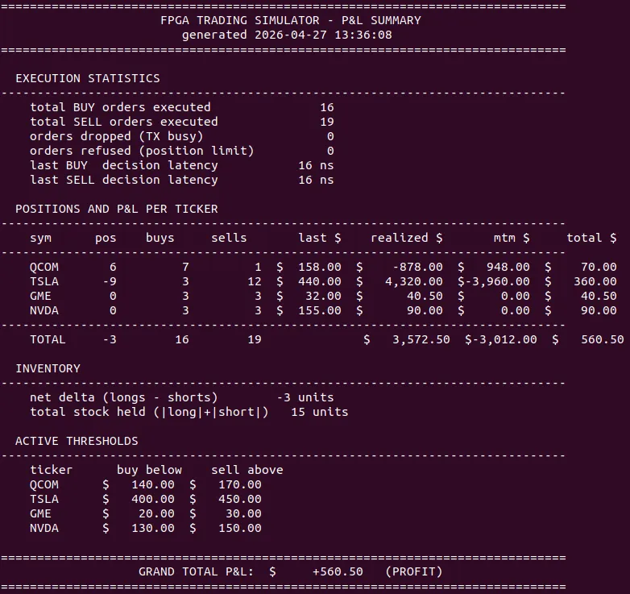

# FPGA Low-Latency Trading Engine over 1 Gb Ethernet

A closed-loop, multi-instrument FPGA trading engine running on a Xilinx Artix-7
(Alientek Da Vinci Pro V4.0 / XC7A100T-FGG484, on-board Motorcomm YT8511 RGMII
PHY), talking 1 Gigabit Ethernet to a Linux host.

The FPGA receives market-data tick frames, evaluates per-ticker buy/sell
thresholds in hardware, manages position state with a configurable risk limit,
and emits order responses back to the host with hardware-computed Ethernet FCS.

**End-to-end decision latency, fire pulse to first byte on the wire: 16 ns
(2 cycles at 125 MHz).**

This is the source code for an undergraduate dissertation project at Swansea
University. The accompanying paper documents the design choices, the
physical-layer bringup (YT8511 strap-pin diagnosis, BUFIO/BUFR receive-clock
fix, 90&deg; MMCM transmit-clock skew), and a full P&amp;L demonstration across
35 executed orders.



---

## Result snapshot

After driving 35 orders across four tickers in a closed-loop session:

```
==============================================================================
                      FPGA TRADING SIMULATOR - P&L SUMMARY
==============================================================================

  EXECUTION STATISTICS
    total BUY orders executed               16
    total SELL orders executed              19
    orders dropped (TX busy)                 0
    orders refused (position limit)          0
    last BUY  decision latency           16 ns
    last SELL decision latency           16 ns

  POSITIONS AND P&L PER TICKER
    sym      pos    buys     sells       last $    realized $       mtm $     total $
    QCOM       6         7         1  $  158.00  $    -878.00  $   948.00  $    70.00
    TSLA      -9         3        12  $  440.00  $   4,320.00  $-3,960.00  $   360.00
    GME        0         3         3  $   32.00  $      40.50  $     0.00  $    40.50
    NVDA       0         3         3  $  155.00  $      90.00  $     0.00  $    90.00
    TOTAL     -3        16        19              $   3,572.50  $-3,012.00  $   560.50

==============================================================================
                   GRAND TOTAL P&L:  $     +560.50   (PROFIT)
==============================================================================
```

---

## Architecture

```
+----------+   tick (0x88B6)   +-----------------+   order (0x88B7)   +----------+
|  Linux   | ----------------> |      FPGA       | -----------------> |  Linux   |
|   host   |                   |   parser FSM    |                    |   host   |
| (Python) | <===============  | -> register file| <================  | (Python) |
+----------+  config (0x88B8)  | -> threshold cmp |  stats (0x88B9)   +----------+
              heartbeat        | -> hw CRC32 TX  |  + heartbeat (0x88B5)
                               +-----------------+
```

### Frame protocol on the wire

| EtherType | Direction | Magic | Body | Purpose |
|-----------|-----------|-------|------|---------|
| `0x88B5` | FPGA &rarr; host | `"HBT "` | 50 B | Heartbeat (1 Hz) |
| `0x88B6` | host &rarr; FPGA | `0xCAFEBABE` | 46 B | Tick: ticker + price |
| `0x88B7` | FPGA &rarr; host | `0xDEC15101` | 50 B | Order: action + ticker + price |
| `0x88B8` | host &rarr; FPGA | `"CONF"` | 50 B | Set buy/sell thresholds |
| `0x88B9` | FPGA &rarr; host | `"STAT"` | 196 B | Stats + per-ticker P&L |

Stats frames are emitted every 1 second AND immediately after each accepted
CONFIG frame (acts as the ACK).

### Verification captures

Wireshark / tcpdump captures of each frame type, used to verify the wire
protocol matches the specification:

| File | Frame type |
|------|-----------|
| [`assets/0x88b5.png`](assets/0x88b5.png) | Heartbeat (FPGA &rarr; host) |
| [`assets/0x88b6.png`](assets/0x88b6.png) | Tick (host &rarr; FPGA) |
| [`assets/0x88b7.png`](assets/0x88b7.png) | Order response (FPGA &rarr; host) |
| [`assets/0x88b7_tcpdump.png`](assets/0x88b7_tcpdump.png) | Order response, tcpdump hex view |
| [`assets/0x88b9.png`](assets/0x88b9.png) | Stats / P&L (FPGA &rarr; host) |

### Tickers and starting thresholds

Hardcoded in `fpga_top.v` as `INIT_*` localparams. Settable at runtime via
CONFIG frames.

| Ticker | Buy below | Sell above |
|--------|-----------|------------|
| QCOM | $155.00 | $160.00 |
| TSLA | $400.00 | $450.00 |
| GME  | $20.00  | $30.00  |
| NVDA | $130.00 | $150.00 |

Position limit: &plusmn;100 contracts per ticker. Orders that would push past
the limit are refused and counted in `refused_pos[ticker]`.

---

## Resource utilisation

Final v4 build on XC7A100T-2FGG484 (Vivado 2025.2, place-and-route). Full
utilisation report in [`docs/final_hft_utilization.txt`](docs/final_hft_utilization.txt).

| Resource | Used | Available | Utilisation |
|----------|------|-----------|-------------|
| Slice LUTs | 188 | 63,400 | 0.30% |
| Slice Registers (FF) | 199 | 126,800 | 0.16% |
| Occupied Slices | 89 | 15,850 | 0.56% |
| Block RAM tiles | 0 | 135 | 0.00% |
| DSP slices | 0 | 240 | 0.00% |
| IDDR primitives | 5 | 285 | 1.75% |
| ODDR primitives | 6 | 285 | 2.11% |
| BUFGCTRL | 4 | 32 | 12.50% |
| MMCM | 1 | 6 | 16.67% |

Final timing: WNS = +2.868 ns, WHS = +0.173 ns, zero failed routes.

---

## Build and program

In Vivado 2025.2:

1. Create a new project for `xc7a100tfgg484-2`.
2. Add `fpga_top.v` as a design source.
3. Add `pins.xdc` as a constraint source.
4. Run synthesis &rarr; implementation &rarr; generate bitstream.
5. Open Hardware Manager &rarr; Open Target &rarr; Program Device with the
   generated `.bit` file.

Verify the link on the host:

```bash
sudo ip link set enp4s0 up
sudo ethtool enp4s0 | grep Speed   # should show 1000Mb/s
```

(Replace `enp4s0` with your NIC name throughout.)

---

## Running the demo

Three terminals.

**Terminal 1 &mdash; live stats:**
```bash
sudo python3 read_stats.py enp4s0
```

**Terminal 2 &mdash; raw frame inspection (optional):**
```bash
sudo tcpdump -i enp4s0 -e -nn 'ether proto 0x88b5 or ether proto 0x88b7 or ether proto 0x88b9'
```

**Terminal 3 &mdash; drive the system:**
```bash
# Demo: 12 ticks across all 4 tickers, expect 8 orders to fire
sudo python3 send_ticks.py enp4s0 mixed

# Send a few prices for one ticker
sudo python3 send_ticks.py enp4s0 QCOM 15000 16100 14900

# Update QCOM thresholds at runtime (FPGA emits a stats ACK immediately)
sudo python3 send_config.py enp4s0 QCOM 14000 17000

# Verify the new thresholds took effect
sudo python3 send_ticks.py enp4s0 QCOM 13900    # below new buy_below
sudo python3 send_ticks.py enp4s0 QCOM 17500    # above new sell_above
```

For a single P&L snapshot suitable for a screenshot:

```bash
sudo python3 pnl_summary.py enp4s0
```

---

## LEDs

| LED | Meaning |
|-----|---------|
| `led[0]` | "alive" &mdash; solid once PHY init complete and autoneg settled |
| `led[1]` | RX activity &mdash; ~100 ms pulse per incoming frame |
| `led[2]` | BUY fired &mdash; ~100 ms pulse per BUY response emitted |
| `led[3]` | SELL fired &mdash; ~100 ms pulse per SELL response emitted |

In normal operation: `led[0]` solid, `led[1]` flickers when ticks arrive,
`led[2]`/`led[3]` flicker briefly when a threshold is crossed.

---

## Pin map (Alientek Da Vinci Pro V4.0 core board)

System clock: R4 (50 MHz crystal).

PHY signals (YT8511 on core board):

```
RGMII0_TXC      V18         RGMII0_RXC      U20
RGMII0_TXCTL    V19         RGMII0_RXCTL    AA20
RGMII0_TXD0     T21         RGMII0_RXD0     AA21
RGMII0_TXD1     U21         RGMII0_RXD1     V20
RGMII0_TXD2     P19         RGMII0_RXD2     U22
RGMII0_TXD3     R19         RGMII0_RXD3     V22  (also MODE_SEL strap)
PHY_RST_N       N20         PHY_MDC         M20
PHY_MDIO        N22
```

LEDs: V9 (`led[0]`), Y8 (`led[1]`), Y7 (`led[2]`), W7 (`led[3]`).

All RGMII pins use `IOSTANDARD LVCMOS33`; TX pins use `SLEW FAST`.

---

## Two non-obvious bringup issues

These are the parts of the design that took the longest to figure out.
The full story is in the dissertation paper.

### 1. RXD3 strap override

The YT8511's `MODE_SEL` is latched from RXD3 and LED_1000 at the rising
edge of `RESET_N`. On the Alientek board, RXD3 has no external pull-up,
so the chip's internal pull-down wins &rarr; strap = `00` &rarr; "Force
Low-Power Mode". In that mode the link still comes up, autoneg still
completes, MDIO still works, but RGMII TX is silently gated.

The fix is to drive RXD3 high through an `IOBUF` for the first 1.7 seconds
of operation, overriding the strap during the PHY's reset-release window,
then releasing the buffer to high-Z so the pin can resume its normal RX
duty.

### 2. RX clock distribution

RXC must go through `IBUF -> BUFIO` for the IDDR clock pins (preserves
the carefully-arranged "RXC centred on data eye" timing the PHY's RXC-delay
strap creates) and `IBUF -> BUFR` (in BYPASS mode) for the parser logic.
Routing RXC through `BUFG` instead introduces 2-3 ns of insertion delay,
shifting the IDDR sampling edge from the centre of the data eye into the
data transition region and producing random output bytes.

### Bonus: 90&deg; transmit clock skew

The transmit-side fix is the standard one for RGMII: an MMCM produces
two 125 MHz outputs, one in-phase used for the TXD ODDRs and one phase-shifted
by 90&deg; (about 2 ns) used for the TXC ODDR. This puts the receiver's
sampling edge in the centre of the data eye rather than on the bit transition.

---

## Repository layout

```
fpga_top.v          Verilog top module (single-file design)
pins.xdc            Vivado constraints (pin map, IOSTANDARDs)
send_ticks.py       Send tick frames; auto-learns current thresholds
send_config.py      Send a CONFIG frame to update thresholds at runtime
read_stats.py       Live stats viewer with P&L breakdown
pnl_summary.py      One-shot P&L report for screenshots
README.md           This file
LICENSE             MIT licence
.gitignore          Vivado / Python build artefact ignores
assets/             Wireshark / tcpdump captures and the P&L screenshot
docs/               Supplementary material (full Vivado utilisation report)
```

---

## Author

Ridhwaan Hasnath, Faculty of Science and Engineering, Swansea University.

Supervised by Dr. Ali Anwar.

## Licence

MIT &mdash; see `LICENSE`.
